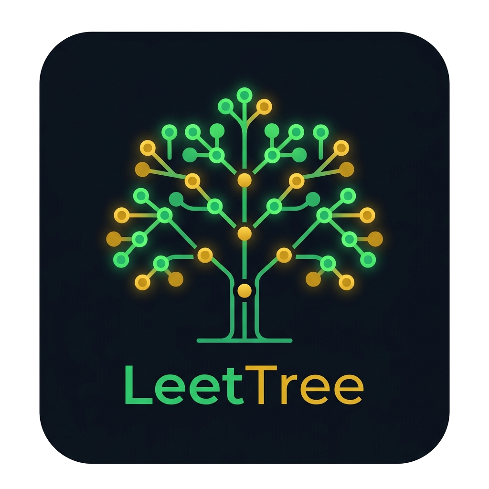

  
  <h1>🌳 LeetTree Notes</h1>
  
<strong>A cozy, local-first Chrome extension to store and organize your LeetCode journey.</strong>

---

If you've ever solved a problem and thought, *"I am absolutely going to forget how I did this by tomorrow"*, LeetTree is for you. 

Instead of dealing with scattered text files, Notion databases that take too long to load, or messy code comments, LeetTree integrates directly into your browser. It's a personal hub where you can save problems, write down your thought process, draw diagrams, and easily find them later.

## ✨ Why LeetTree?

- 🖱️ **One-Click Saves:** Click the LeetTree button directly on any LeetCode page. It instantly grabs the problem description, your code, and the URL.
- 🎨 **Built-in Whiteboard:** Some problems just need a drawing. Open the whiteboard directly in your notes to sketch out sliding windows, graphs, or recursion trees. 
- 📂 **Folders & Topics:** Group your problems. Build a folder for "Dynamic Programming" or "Arrays" and keep all related problems together.
- 🧠 **Smart Practice:** Don't know what to review? Sort by `Suggested Practice 🧠` and the app will surface problems you haven't looked at in a while or ones you've explicitly marked for revision.
- 🙈 **Active Recall:** Your saved code is blurred out by default so you can try to remember the logic before peeking!
- 🔒 **100% Offline & Private:** Everything is stored locally in your browser using Chrome Storage. It's blazing fast, completely offline, and your data stays yours. 

## 🚀 Setup Guide

Since LeetTree runs completely locally, you can install it in seconds using Developer Mode:

1. **Download** or clone this repository to your computer.
2. Open Chrome and go to `chrome://extensions/` (or click Manage Extensions).
3. Toggle on **Developer mode** in the top-right corner.
4. Click **Load unpacked** in the top-left corner.
5. Select the `LeetTree-Notes` folder you just downloaded.
6. **Done!** Pin the 🌳 icon to your toolbar. Click it to open your dashboard, or just visit a LeetCode problem to see the magic button.

## 💾 Backing Up Your Data

Because LeetTree is local-first, if you uninstall the extension, your browser *might* clear the data.
- **Export:** Click the "Export as Markdown" or "Export" buttons in the dashboard to save a JSON backup of all your hard work.
- **Import:** You can restore your data at any time using the Import button.

---
*Happy coding! Built to make storing your LeetCode notes just a little bit easier.*
